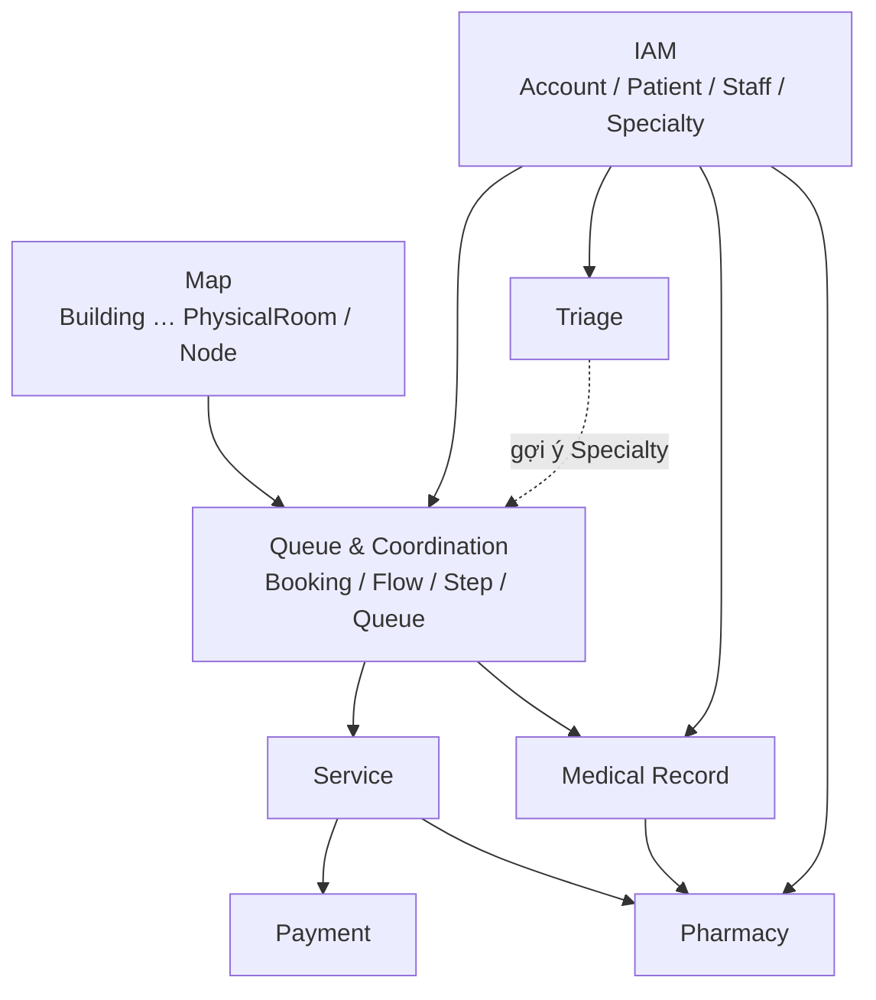
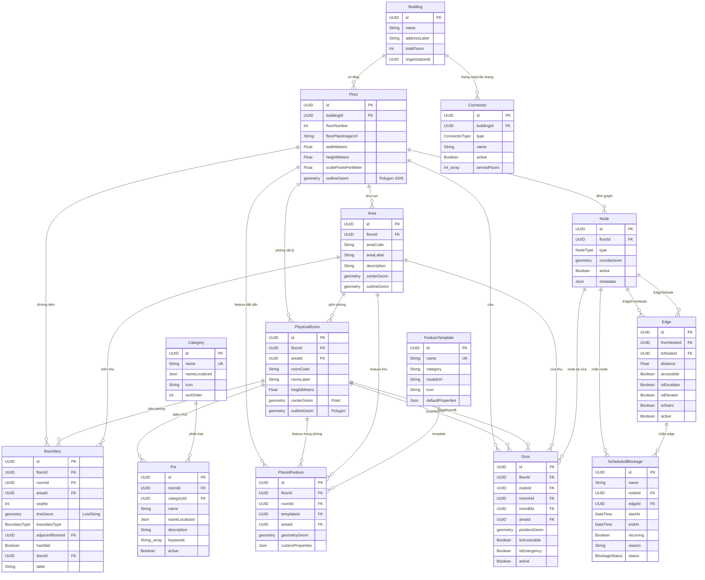
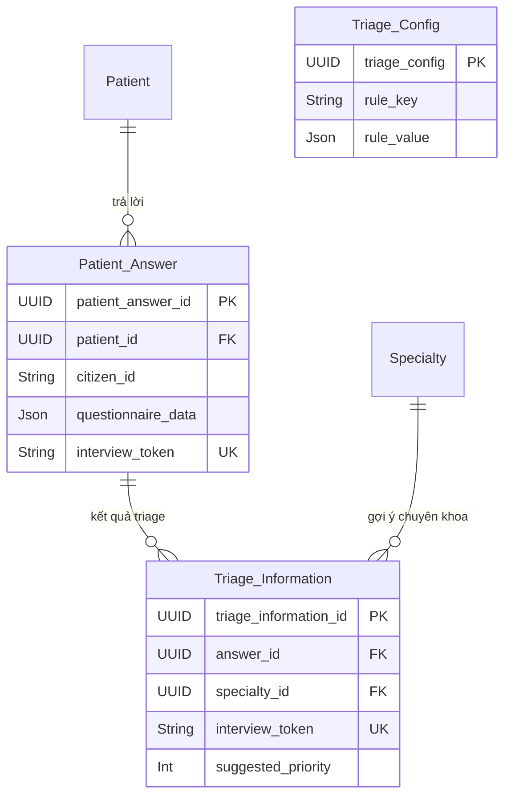
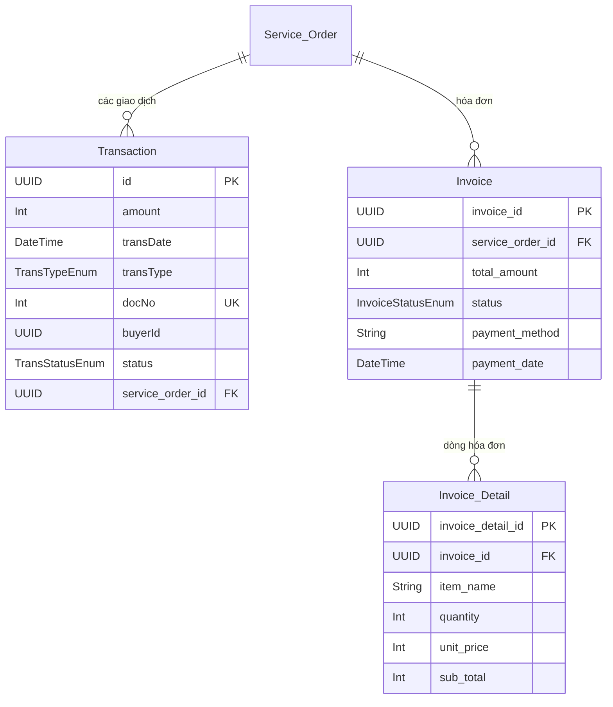
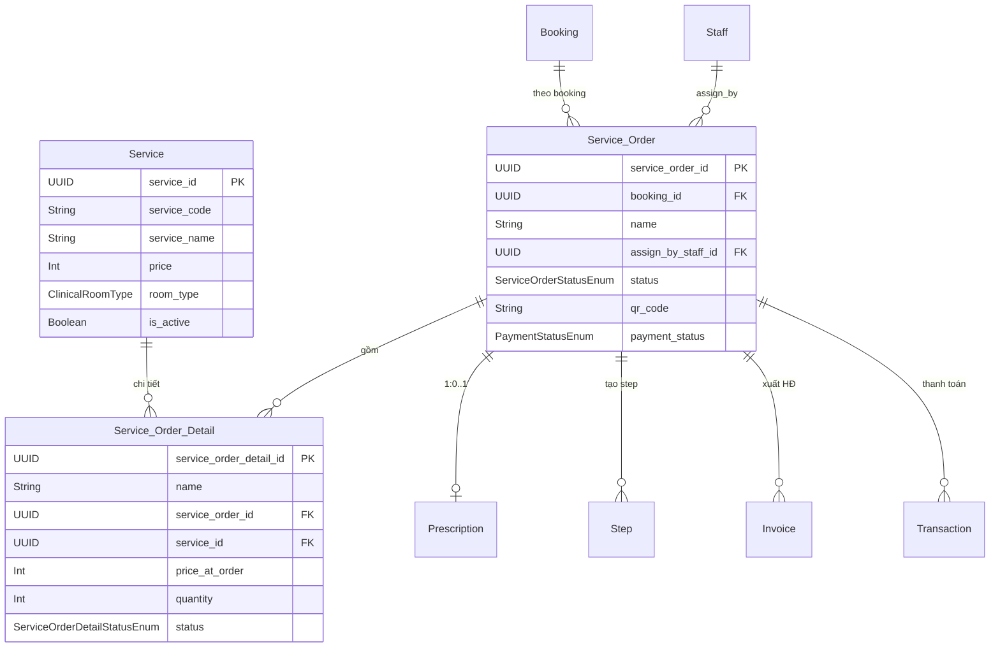
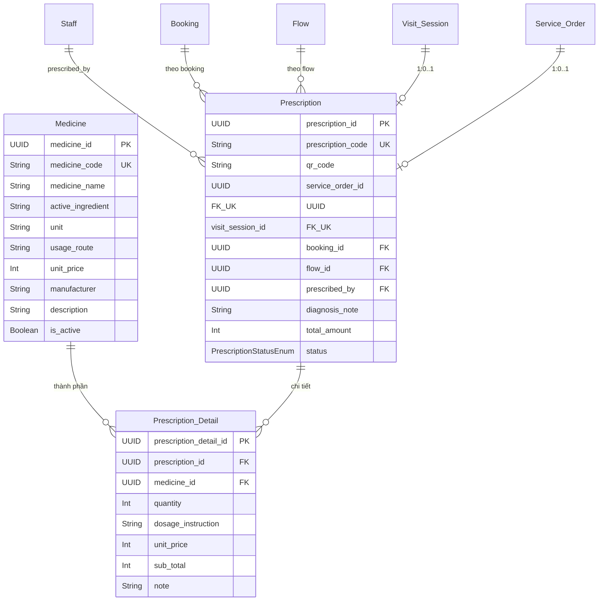
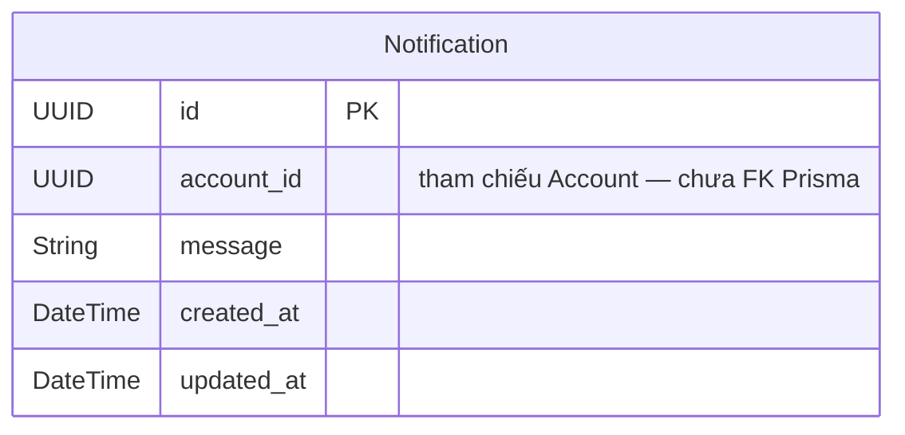

# TriageFlow OPD — Entity Relationship Diagram (ERD)

Tổng hợp từ `prisma/schema.prisma`. PK mặc định là `UUID`. Geometry dùng PostGIS (`geometry(..., 4326)`).

## Tổng quan module

| #   | Module                         | Vai trò                         | Entities chính                                                                                                                               |
| -----| --------------------------------| ---------------------------------| ----------------------------------------------------------------------------------------------------------------------------------------------|
| 1   | **Map**                        | Bản đồ không gian, POI, routing | Building, Floor, PhysicalRoom, Area, Boundary, Door, Node, Edge, Connector, Category, Poi, FeatureTemplate, PlacedFeature, ScheduledBlockage |
| 2   | **Queue & Coordination**       | Luồng khám, hàng đợi, lịch/ca   | Booking, Slot, Shift, Flow, Step, Step_Dependency, Queue, Move_Log, Room, Flow_Template, Flow_Rules_Config                                   |
| 3   | **Triage**                     | Phân loại / gợi ý chuyên khoa   | Patient_Answer, Triage_Information, Triage_Config                                                                                            |
| 4   | **IAM**                        | Định danh & phân quyền          | Account, Patient, Staff, Specialty                                                                                                           |
| 5   | **Payment**                    | Thanh toán & hóa đơn            | Transaction, Invoice, Invoice_Detail                                                                                                         |
| 6   | **Service**                    | Catalog dịch vụ & chỉ định      | Service, Service_Order, Service_Order_Detail                                                                                                 |
| 7*  | **Medical Record** *(đề xuất)* | Hồ sơ khám lâm sàng             | Visit_Session, Clinical_Document                                                                                                             |
| 8*  | **Pharmacy** *(đề xuất)*       | Đơn thuốc & thuốc               | Prescription, Prescription_Detail, Medicine                                                                                                  |
| 9*  | **Notification** *(đề xuất)*   | Thông báo người dùng            | Notification                                                                                                                                 |

> `*` = đã có model trong schema; nên tách module tài liệu/ownership cho rõ ranh giới domain.

---

## Sơ đồ liên kết liên module (high-level)



**Bridge quan trọng**

- `Room` (phòng logic lâm sàng) ↔ `PhysicalRoom` (phòng trên bản đồ)
- `Booking` → `Flow` → `Step` → `Queue` (chuỗi điều phối)
- `Service_Order` nối Queue, Payment, Pharmacy

---

## 1. Map Module

Không gian bệnh viện, thư mục POI, đồ thị dẫn đường, tài sản 3D/feature, lịch chặn đường đi.



### Enums (Map)

| Enum | Values |
|------|--------|
| `BoundaryType` | WALL, DOOR, WINDOW, OPEN |
| `NodeType` | ROOM_ENTRANCE, CORRIDOR, ELEVATOR, STAIRS, ESCALATOR, EXIT, JUNCTION |
| `ConnectorType` | ELEVATOR, STAIRS, ESCALATOR, RAMP |
| `BlockageStatus` | ACTIVE, SCHEDULED, CANCELLED, EXPIRED |

### Ghi chú

- Corridor = `Floor.outlineGeom` trừ các `PhysicalRoom.outlineGeom`.
- `Door.roomBId` nullable: cửa ra hành lang chỉ có `roomA`.
- `ScheduledBlockage` độc lập nhưng phụ thuộc Node/Edge (cascade).

---

## 2. Queue & Coordination Module

Lịch khám → booking → flow các bước → hàng đợi / điều phối phòng & nhân sự.

```mermaid
erDiagram
  Staff ||--o{ Shift : "làm ca"
  Room ||--o{ Shift : "ca tại phòng logic"
  PhysicalRoom ||--o{ Shift : "ca tại phòng vật lý"
  Shift ||--o{ Slot : "khung giờ"
  Patient ||--o{ Booking : "đặt lịch"
  Slot ||--o{ Booking : "slot"
  Booking ||--o| Flow : "1:1"
  Booking ||--o| Visit_Session : "1:0..1"
  Flow ||--o{ Step : "các bước"
  Flow ||--o{ Prescription : "đơn thuốc"
  Room ||--o{ Step : "thực hiện tại"
  Staff ||--o{ Step : "phụ trách"
  PhysicalRoom ||--o{ Step : "vị trí map"
  Service_Order ||--o{ Step : "gắn chỉ định"
  Step ||--o{ Step : "parent / sub_step"
  Step ||--o{ Step_Dependency : "StepNeedsToWait"
  Step ||--o{ Step_Dependency : "StepIsDependedOn"
  Step ||--o{ Queue : "hàng đợi"
  Queue ||--o{ Move_Log : "log di chuyển"
  Specialty ||--o{ Room : "phòng theo chuyên khoa"
  PhysicalRoom ||--o{ Room : "map ↔ logic"

  Booking {
    UUID booking_id PK
    UUID patient_id FK
    UUID slot_id FK
    BookingStatusEnum status
  }

  Slot {
    UUID slot_id PK
    UUID shift_id FK
    Int slot_index
    String start_time
    String end_time
    Int capacity
    Int max_capacity
    SlotStatusEnum status
  }

  Shift {
    UUID shift_id PK
    UUID staff_id FK
    UUID room_id FK
    UUID physicalRoomId FK
    DateTime date
    String start_time
    String end_time
  }

  Flow {
    UUID flow_id PK
    UUID booking_id FK_UK
    FlowStatusEnum status
  }

  Step {
    UUID step_id PK
    String step_name
    UUID flow_id FK
    UUID room_id FK
    UUID staff_id FK
    UUID service_order_id FK
    UUID parent_step_id FK
    UUID physicalRoomId FK
    StepStatusEnum step_status
    String service_code
    StepTypeEnum step_type
  }

  Step_Dependency {
    UUID id PK
    UUID step_id FK
    UUID depends_on_step_id FK
  }

  Queue {
    UUID queue_id PK
    UUID step_id FK
    String queue_number
    QueueStatusEnum status
  }

  Move_Log {
    UUID log_id PK
    UUID queue_id FK
    String action_type
  }

  Room {
    UUID room_id PK
    String room_name
    ClinicalRoomType room_type
    UUID physical_room_id FK
    UUID specialty_id FK
  }

  Flow_Template {
    UUID template_id PK
    String template_name
    Json_array steps
  }

  Flow_Rules_Config {
    UUID flow_rules_config_id PK
    Json conditions
    Json actions_to_generate
  }
```

### Enums (Queue & Coordination)

| Enum | Values |
|------|--------|
| `SlotStatusEnum` | AVAILABLE, FULL, CLOSED |
| `BookingStatusEnum` | AVAILABLE, CANCELLED |
| `FlowStatusEnum` | PENDING, IN_PROGRESS, COMPLETED, ABANDONED, CANCELLED |
| `QueueStatusEnum` | PENDING, QUEUED, CALLED, SERVING, FINISHED, MISSING, CANCELLED |
| `StepStatusEnum` | PENDING, IN_PROGRESS, COMPLETED, DECLINED, CANCELLED |
| `StepTypeEnum` | REGISTRATION, TRIAGE, CLINICAL, PROCEDURE, LAB_TEST, IMAGING, FUNCTIONAL_EXPLORATION, PAYMENT, DISPENSING, OTHER |
| `ClinicalRoomType` | RECEPTION, TRIAGE_AREA, CLINICAL_ROOM, PROCEDURE_ROOM, LABORATORY, IMAGING_ROOM, FUNCTIONAL_EXPLORATION, PHARMACY, CASHIER, EMPTY, OTHER |

### Ghi chú

- `Step_Dependency`: step A phụ thuộc step B → B xong mới làm A.
- `Flow_Template` / `Flow_Rules_Config`: cấu hình sinh flow (JSON), không FK runtime.
- `Move_Log`: audit hành động di chuyển theo queue (hỗ trợ Map navigation).

---

## 3. Triage Module

Thu thập câu trả lời phỏng vấn → gợi ý chuyên khoa / độ ưu tiên.



### Ghi chú

- `Patient_Answer` cho phép `patient_id` null (guest / pre-registration theo `citizen_id` / `interview_token`).
- `Triage_Config`: rule engine dạng key–value JSON (không FK).
- Kết quả triage thường dẫn tới chọn `Specialty` → booking / room phù hợp (liên module Queue).

---

## 4. IAM (Identity & Access Management)

Tài khoản, bệnh nhân, nhân sự, chuyên khoa.

```mermaid
erDiagram
  Account ||--o{ Patient : "sở hữu hồ sơ BN"
  Account ||--o| Staff : "1:0..1 hồ sơ NV"
  Specialty ||--o{ Staff : "chuyên khoa"
  Specialty ||--o{ Room : "phòng logic"
  Specialty ||--o{ Triage_Information : "gợi ý"

  Account {
    UUID account_id PK
    String avatar
    String user_name
    String email UK
    RoleTypeEnum role
    GenderTypeEnum gender
    String phone UK
    Boolean is_banned
  }

  Patient {
    UUID patient_id PK
    UUID account_id FK
    String medical_coverage_id UK
    String full_name
    DateTime dob
    GenderTypeEnum gender
    String citizen_id UK
    String blood_type
    String allergy_notes
  }

  Staff {
    UUID staff_id PK_FK " = account_id"
    String full_name
    String license_number
    Int experience_years
    UUID specialty_id FK
  }

  Specialty {
    UUID specialty_id PK
    String specialty_code UK
    String specialty_name
    String description
  }
```

### Enums (IAM)

| Enum | Values |
|------|--------|
| `RoleTypeEnum` | USER, DOCTOR, RECEPTIONIST, NURSE, LAB_TECHNICIAN, PHARMACIST, ADMIN |
| `GenderTypeEnum` | MALE, FEMALE |

### Ghi chú

- `Staff.staff_id` = `Account.account_id` (shared PK / 1:1).
- `Patient.blood_type`, `allergy_notes`: thuộc tính hồ sơ lâu dài (xem thêm Medical Record).

---

## 5. Payment Module

Giao dịch thanh toán / hoàn tiền và hóa đơn theo service order.



### Enums (Payment)

| Enum | Values |
|------|--------|
| `TransStatusEnum` | SUCCESSED, CANCELLED, PENDING |
| `TransTypeEnum` | APPOINTMENT_PAYMENT, APPOINTMENT_REFUND, BOOKING_PAYMENT_1, BOOKING_PAYMENT_2, BOOKING_REFUND, ORDER_PAYMENT, ORDER_REFUND, WALLET_TOP_UP, WALLET_WITHDRAW |
| `PaymentStatusEnum` | PENDING, PROCESSING, SUCCESSED, EXPIRED, CANCELLED *(dùng trên Service_Order)* |
| `InvoiceStatusEnum` | PENDING, PAID, CANCELLED |

### Ghi chú

- `Transaction.buyerId` tham chiếu người mua (Account/Patient) — hiện chưa khai báo FK Prisma tường minh.
- Mã loại giao dịch theo convention số: 11/19 appointment, 21/22/29 booking, 31/39 order, 41/42 wallet.

---

## 6. Service Module

Catalog dịch vụ và phiếu chỉ định (service order).



### Enums (Service)

| Enum | Values |
|------|--------|
| `ServiceOrderStatusEnum` | PENDING, IN_PROGRESS, COMPLETED, CANCELLED, PAID |
| `ServiceOrderDetailStatusEnum` | PENDING, PAID, IN_PROGRESS, COMPLETED, CANCELLED |

### Ghi chú

- `Service.room_type` gợi ý loại phòng logic cần thiết khi sinh step.
- `price_at_order` snapshot giá tại thời điểm chỉ định.

---

## 7. Medical Record Module *(đề xuất tách)*

Hồ sơ theo phiên khám — đã có trong schema; chi tiết cũ: [`medical_record.md`](./medical_record.md).

```mermaid
erDiagram
  Patient ||--o{ Visit_Session : "nhiều phiên"
  Booking ||--o| Visit_Session : "1:0..1"
  Visit_Session ||--o{ Clinical_Document : "tài liệu lâm sàng"
  Visit_Session ||--o| Prescription : "1:0..1"

  Visit_Session {
    UUID visit_session_id PK
    UUID patient_id FK
    UUID booking_id FK_UK
    DateTime visit_date
    String chief_complaint
    Int heart_rate
    Int blood_pressure_sys
    Int blood_pressure_dia
    Float temperature
    Int spo2
    String diagnosis
    String final_diagnosis
    String hpi
    String pmh
    Json pe
  }

  Clinical_Document {
    UUID clinical_document_id PK
    UUID visit_session_id FK
    ClinicalDocumentTypeEnum document_type
    Json payload_data
    String his_reference_id
  }
```

| Enum | Values |
|------|--------|
| `ClinicalDocumentTypeEnum` | PRESCRIPTION, LAB_TEST, IMAGING_TEST, PROCEDURE, OTHER |

**Lý do tách module:** khác Queue (điều phối vận hành) — đây là dữ liệu lâm sàng / EMR, có thể đồng bộ HIS qua `his_reference_id`.

---

## 8. Pharmacy Module *(đề xuất tách)*



| Enum | Values |
|------|--------|
| `PrescriptionStatusEnum` | PENDING, PROCESSING, PREPARED, DISPENSED, CANCELLED, EXPIRED |

**Lý do tách module:** kho thuốc + phát thuốc (DISPENSING step) là domain riêng so với Service catalog chung.

---

## 9. Notification Module *(đề xuất tách)*



**Lý do tách / cải thiện:** hiện thiếu quan hệ Prisma tới `Account`; nên bổ sung FK + trạng thái đọc (`is_read`) nếu module thông báo mở rộng.

---

## Ma trận quan hệ xuyên module (tóm tắt)

| Từ | Đến | Quan hệ | Ý nghĩa |
|----|-----|---------|---------|
| Account | Patient / Staff | 1:N / 1:1 | IAM |
| Patient | Booking | 1:N | Đặt lịch |
| Booking | Flow | 1:1 | Bắt đầu điều phối |
| Flow | Step | 1:N | Các bước trong ngày khám |
| Step | Queue | 1:N | Số thứ tự tại điểm phục vụ |
| Step | Room / PhysicalRoom | N:1 | Phòng logic / vị trí map |
| Room | PhysicalRoom | N:1 | Bridge Map ↔ Queue |
| Patient_Answer | Triage_Information | 1:N | Kết quả triage |
| Triage_Information | Specialty | N:1 | Gợi ý chuyên khoa |
| Booking | Service_Order | 1:N | Chỉ định DV |
| Service_Order | Invoice / Transaction | 1:N | Thanh toán |
| Service_Order | Step | 1:N | Sinh bước thực hiện |
| Patient | Visit_Session | 1:N | Hồ sơ phiên khám |
| Visit_Session / Service_Order | Prescription | 1:0..1 | Đơn thuốc |

---

## Đề xuất module bổ sung (ngoài 6 module gốc)

| Module đề xuất | Entities | Ưu tiên | Ghi chú |
|----------------|----------|---------|---------|
| **Medical Record** | Visit_Session, Clinical_Document | Cao | Đã có schema; tách khỏi Queue |
| **Pharmacy** | Medicine, Prescription, Prescription_Detail | Cao | Đã có API guide riêng |
| **Notification** | Notification | Trung bình | Bổ sung FK Account, read-state |
| **Scheduling** *(tuỳ chọn)* | Shift, Slot, Booking | Thấp | Có thể tách khỏi Queue nếu team lớn; hiện gộp trong Queue & Coordination là hợp lý |
| **Organization / Multi-tenant** *(tương lai)* | Organization (chưa có model) | Thấp | `Building.organizationId` đã có nhưng chưa có bảng Organization |

---

## Nguồn chân lý

- Schema: [`prisma/schema.prisma`](../../prisma/schema.prisma)
- Medical Record (chi tiết cũ): [`docs/erd/medical_record.md`](./medical_record.md)
- Map schema plan: [`docs/plans/phase-02-database-schema.md`](../plans/phase-02-database-schema.md)
