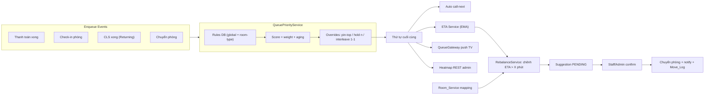

# Queue Management Nâng Cao — Tổng Quan & Lộ Trình

> Tài liệu này là điểm bắt đầu. Đọc file này TRƯỚC khi thực hiện bất kỳ phase nào.
> Mỗi phase là 1 file markdown riêng trong `docs/queue/`, được thiết kế để 1 AI agent có thể đọc và triển khai độc lập (miễn là các phase phụ thuộc đã hoàn thành).

## 1. Mục tiêu tổng thể

Nâng cấp hệ thống hàng chờ OPD từ FIFO đơn thuần (sort theo `step.created_at`) lên:

1. **Priority engine động**: điểm ưu tiên theo rule (trẻ em, người già, thai phụ, có lịch hẹn...) + aging theo thời gian chờ.
2. **Xử lý chen hàng**: các use case thực tế trong [priority.md](./priority.md) — trả kết quả CLS (interleave 1-1), manual override (pin top), lỡ lượt (lùi n vị trí), chuyển phòng, thủ thuật nhanh.
3. **ETA realtime** cho từng hàng chờ và từng bệnh nhân (EMA từ dữ liệu thực tế + fallback config).
4. **Admin cấu hình được** toàn bộ rule (global + override theo loại phòng/chuyên khoa).
5. **Manual override có phân quyền**: ADMIN hoặc staff đang phụ trách phòng đó.
6. **Heatmap** mật độ chờ theo phòng cho admin (REST, FE polling).
7. **Load balancing**: điều phối động giữa các hàng chờ tương đương (chỉ hàng chờ KHÔNG gắn booking: xét nghiệm, chẩn đoán hình ảnh, thủ thuật) — gợi ý chuyển khi chênh ETA vượt ngưỡng, staff xác nhận mới chuyển.

## 2. Các quyết định kiến trúc ĐÃ CHỐT (không thay đổi khi triển khai)

| Quyết định | Lựa chọn |
| --- | --- |
| Mô hình sắp xếp | **Hybrid**: score (weight + aging) quyết định thứ tự nền + lớp override cấu trúc (pin-top, hold n vị trí, interleave 1-1) |
| ETA | **Hybrid EMA**: timestamps thực tế → EMA theo (room, step_type), fallback `default_duration_sec` do admin cấu hình khi `sample_count < 5` |
| Scope rule | Global + override theo `ClinicalRoomType` / `specialty_id` (rule cụ thể hơn đè rule global) |
| Heatmap | REST snapshot, FE tự polling (KHÔNG cần WebSocket, KHÔNG cần bảng thống kê lịch sử) |
| Call-next | Auto: hệ thống tự chọn người đứng đầu theo engine; vẫn nhận `step_id` optional để gọi đích danh |
| Load balancing scope | Cả 2 lớp: chọn phòng ít tải nhất lúc enqueue + re-balance khi nghẽn |
| Load balancing mode | **Bán tự động**: hệ thống sinh suggestion, staff/admin confirm mới chuyển thật |
| Metric nghẽn | Chênh lệch **ETA** giữa các phòng cùng nhóm > ngưỡng X phút (admin cấu hình, mặc định 15) |
| Nhóm phòng tương đương | Bảng mapping **`Room_Service`** (admin khai báo phòng nào làm được service nào) |
| Khi chuyển phòng | Cấp `queue_number` mới ở phòng đích, **giữ nguyên `enqueued_at` + `base_priority`** (không mất aging) |

## 3. Sơ đồ kiến trúc



## 4. Danh sách phase và phụ thuộc

Thực hiện TUẦN TỰ theo số thứ tự. Mỗi phase phải build pass (`npm run build`) và lint pass trước khi coi là xong.

| Phase | File | Nội dung | Phụ thuộc |
| --- | --- | --- | --- |
| 1 | [phase-1-schema.md](./phase-1-schema.md) | Prisma schema: mở rộng Queue/Move_Log, model mới Queue_Priority_Rule, Room_Service_Stat, Room_Service, Queue_Rebalance_Suggestion + seed rules | — |
| 2 | [phase-2-priority-engine.md](./phase-2-priority-engine.md) | `QueuePriorityService`: evaluate rules khi enqueue + thuật toán computeQueueOrder | Phase 1 |
| 3 | [phase-3-enqueue-integration.md](./phase-3-enqueue-integration.md) | Tích hợp engine vào các điểm enqueue: sau thanh toán, check-in, returning sau CLS, transfer | Phase 2 |
| 4 | [phase-4-lifecycle-endpoints.md](./phase-4-lifecycle-endpoints.md) | Call-next auto, override/miss/recall endpoints, phân quyền, Move_Log, WS emit, cron auto-MISSING | Phase 3 |
| 5 | [phase-5-eta.md](./phase-5-eta.md) | ETA service: cập nhật EMA khi finished, ETA per patient/queue, gắn vào ticket API + TV payload | Phase 4 |
| 6 | [phase-6-load-balancing.md](./phase-6-load-balancing.md) | Room_Service mapping, chọn phòng least-ETA lúc enqueue, rebalance detector + suggestion + confirm flow | Phase 5 |
| 7 | [phase-7-admin-heatmap.md](./phase-7-admin-heatmap.md) | Admin CRUD rules + room-services + default duration, heatmap endpoint | Phase 5 (heatmap), Phase 6 (room-services CRUD) |

## 5. Bối cảnh codebase (đọc kỹ trước khi code)

### Stack & quy ước

- **NestJS 11 + Prisma 7 (PostgreSQL, adapter pg)**. Schema tại `prisma/schema.prisma`, table map snake_case qua `@@map`.
- **KHÔNG có folder `prisma/migrations`** — project dùng `npx prisma db push` để sync schema. Seed là các file `.ts` độc lập trong `prisma/` (xem pattern `prisma/room.seed.ts`: tự tạo PrismaClient với `PrismaPg` adapter + `dotenv`), chạy bằng `npx ts-node prisma/<file>.seed.ts`.
- **Response convention** của mọi service method:

```typescript
return { code: 200, status: 'success', message: 'Thông báo tiếng Việt', data: ... };
```

- **Error convention**: throw `BadRequestException` / `NotFoundException` / `ForbiddenException` với `{ message, detail }` tiếng Việt.
- **Guards** tại `src/shared/guards/`: `is-auth.guard.ts` (JWT), `is-role.guard.ts` (theo `RoleTypeEnum`), `orGuards.ts` (OR nhiều guard), `is_kiosk.guard.ts`.
- **Repository pattern** (một phần codebase dùng): interface tại `src/shared/interfaces/i-*.repository.ts`, implementation tại `src/shared/repositories/prisma-*.repository.ts`, inject qua token string (vd `@Inject('IQueueRepository')`). Queue repository có sẵn nhưng nghèo — có thể mở rộng hoặc dùng PrismaService trực tiếp trong service mới (queue.service.ts hiện dùng PrismaService trực tiếp — theo pattern đó).
- **WebSocket**: `src/shared/gateways/queue.gateway.ts` — room socket theo `room_${roomId}`, event `onQueueUpdate`, method `emitQueueUpdate(roomId, data)`.

### Các file hiện có sẽ bị sửa

| File | Vai trò hiện tại |
| --- | --- |
| `src/routes/queue/queue.service.ts` | `callNextPatient` (yêu cầu step_id thủ công), `getRoomDisplayPayload` (sort `created_at`), `generateServiceQueueNumber` (đánh số tuần tự/phòng/ngày) |
| `src/routes/queue/queue.controller.ts` | Duy nhất 1 endpoint `POST /queue/call-next` |
| `src/routes/ticket/ticket.service.ts` | `checkIn` (dòng ~309) + bản DUPLICATE của `getRoomDisplayPayload` (dòng ~432) — cần hợp nhất về QueueService |
| `src/routes/step/step.service.ts` | `completeStep` → `unlockNextSteps` (dòng ~165): unlock step phụ thuộc khi CLS xong — điểm hook cho RETURNING |
| `src/routes/transaction/transaction.service.ts` | Gọi `generateServiceQueueNumber` sau thanh toán thành công (dòng ~168, ~261) |
| `src/routes/service_order/service_order.service.ts` | Chọn phòng 1 lần lúc tạo chỉ định qua `findBestRoomByRoomType` (dòng ~129) |
| `src/routes/cron/cron.service.ts` | Cron jobs hiện có (flow expired, transaction expired) — thêm cron mới vào đây |
| `prisma/schema.prisma` | `Queue` (dòng ~427), `Move_Log` (~440), `Room` (~328), `Step` (~348), enums |

### Dữ liệu có sẵn để evaluate rule

- `Patient.dob` → tính tuổi; `Patient.gender`.
- `Triage_Information.suggested_priority` (Int?) — điểm ưu tiên từ hệ thống triage.
- `Visit_Session`: `temperature`, `heart_rate`, `spo2`, `blood_pressure_sys/dia` (vitals).
- `Booking.slot.shift`: xác định có lịch hẹn + đúng giờ hay không; step không có flow/booking qua service_order walk-in.
- `Shift` (staff_id, room_id, date, start/end_time): xác định staff đang phụ trách phòng.

## 6. Nguyên tắc chung khi triển khai

1. **Không breaking change**: FE hiện tại đọc `queue_number` (string) và payload TV từ `onQueueUpdate` — giữ nguyên shape cũ, chỉ THÊM field mới. `POST /queue/call-next` vẫn hoạt động khi FE truyền `step_id`.
2. Mọi mutation liên quan queue phải `emitQueueUpdate` cho phòng liên quan.
3. Mọi hành động override/di chuyển phải ghi `Move_Log`.
4. Message người dùng bằng tiếng Việt, code + comment bằng tiếng Anh (comment chỉ khi giải thích intent không hiển nhiên).
5. Sau mỗi phase: `npm run build` và `npm run lint` phải pass. Không viết unit test trừ khi phase yêu cầu.
6. Không sửa các tính năng ngoài scope (booking, payment, navigation, map...) trừ các điểm hook được chỉ định rõ trong từng phase.
