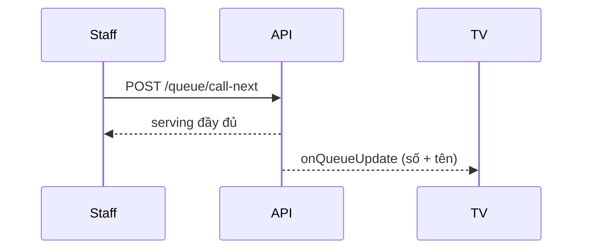
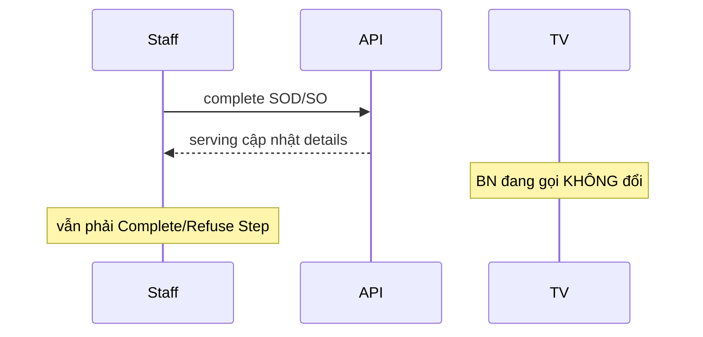
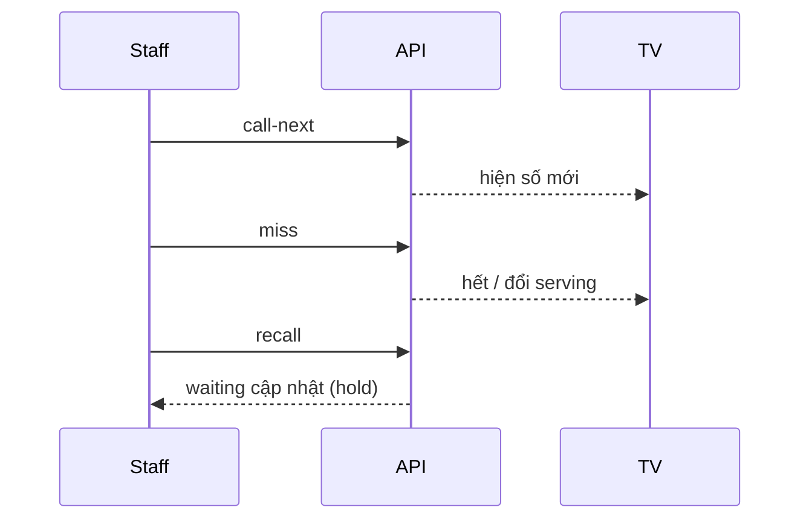

# Queue — Kịch bản demo trực quan

> Dùng kèm [queue guide fe.md](./queue%20guide%20fe.md).  
> Mục tiêu: thuyết trình / nghiệm thu trước FE — **2 màn** (Staff phòng + TV) + 1 màn Admin (tuỳ chọn).

---

## 0. Chuẩn bị (5–10 phút)

### Thiết bị / cửa sổ

| # | Cửa sổ | Nội dung |
| --- | --- | --- |
| A | **Staff phòng** | FE staff (hoặc Swagger/`curl`) — phòng demo |
| B | **TV phòng** | Màn hình lớn / browser full-screen — cùng `roomId` |
| C | **Admin** (optional) | Heatmap + rules |
| D | **BN app** (optional) | Ticket / ETA của 1 bệnh nhân trong hàng |

### Tài khoản

- Staff (hoặc **ADMIN**) có quyền phòng demo (ADMIN bypass; staff cần **shift hôm nay** đúng `room_id`).
- `staff_id` dùng trong `call-next` = UUID staff đang khám.

### Dữ liệu tối thiểu

| Cần | Gợi ý DB hiện tại (smoke 2026-08-04) |
| --- | --- |
| ≥ 3 lượt chờ cùng phòng | Phòng `Phòng Nội tim mạch 5` (`f7510db8-…`) có ~8 `PENDING` |
| Phòng có số dạng `A-xxx` | Phòng `9e6aa3ee-…` có ~5 `QUEUED` (`A-161`, `A-171`…) — đẹp khi demo “số không phải thứ tự gọi” |
| 1 BN có **Service Order + details** gắn step đang chờ | **Hiện `soLinked = 0`** — cần gắn SO vào 1 step đang queue trước khi demo SOD/SO (xem §Phụ lục) |
| TV join cùng `roomId` | `joinRoomDisplay { roomId, staffId }` |

### Checklist kỹ thuật

- [ ] BE chạy (`http://localhost:3000/api`)
- [ ] Đăng nhập lấy Bearer token
- [ ] Staff FE: `GET /queue/room/:roomId` ra `waiting[]`
- [ ] TV: đã nhận `onQueueUpdate` (có `current_patient` / `upcoming_patients`)

---

## 1. Storyboard tổng (≈ 12–15 phút)

```mermaid
flowchart LR
  S1[1. Mở phòng + TV] --> S2[2. Call-next]
  S2 --> S3[3. Serving panel]
  S3 --> S4[4. SOD/SO optional]
  S4 --> S5[5. Complete Step]
  S5 --> S6[6. Call-next tiếp]
  S6 --> S7[7. Miss / Recall]
  S7 --> S8[8. Pin / Override]
  S8 --> S9[9. Refuse Step]
  S9 --> S10[10. Heatmap optional]
```



Narration một câu: *“Hàng chờ không còn FIFO thuần — bác sĩ gọi theo engine, TV sync realtime, và kết thúc lượt phải complete/refuse rõ ràng.”*

---

## 2. Scene chi tiết

### Scene 1 — Mở màn hình phòng (1 phút)

**Làm**

1. Staff mở phòng demo → list **Đang chờ** + **Vắng**.
2. TV cùng phòng hiện “Đang cập nhật” / trống nếu chưa SERVING.

**Chỉ tay**

- Thứ tự list = engine (không sort `queue_number`).
- Badge `reasons`, cột ETA (`eta_minutes`).
- TV chỉ số + tên; Staff sẽ thấy `serving` chi tiết sau call-next.

**API**

- `GET /queue/room/:roomId`
- WS `joinRoomDisplay` → `onQueueUpdate`

---

### Scene 2 — Call-next (auto) (1–2 phút)

**Làm**

1. Staff bấm **Gọi tiếp theo** (không chọn BN).
2. Nhìn **TV**: số đang gọi đổi ngay.
3. Staff: panel **Serving** hiện BN + step (+ SO nếu có).

**Chỉ tay**

- Response / state có `serving.patient`, `serving.step`, `serving.service_order`.
- Phòng chỉ có **1** SERVING.

**API**

```http
POST /api/queue/call-next
Authorization: Bearer <token>
Content-Type: application/json

{ "room_id": "<roomId>", "staff_id": "<staffId>" }
```



---

### Scene 3 — Serving: đọc chỉ định (1 phút)

**Làm**

- Scroll panel: patient (DOB/gender), step type/status, list details.

**Chỉ tay FE**

- Nút Complete/Refuse **từng SOD**, cả **SO**, và **Hoàn thành / Từ chối bước**.
- Nhấn SOD **không** xóa SERVING (phòng vẫn “đang khám”).

---

### Scene 4 — Complete SOD / SO (2 phút) — *cần data SO*

> Nếu chưa gắn SO: bỏ scene này, nhảy Scene 5; ghi chú “payload `service_order: null` là hợp lệ với khám thường”.

**Làm**

1. Complete **1 detail** → status detail đổi, queue vẫn SERVING, TV **không** đổi BN.
2. (Optional) Complete cả SO → SO `COMPLETED`, vẫn SERVING.
3. Refresh `GET /queue/room/:roomId` → `serving` còn nguyên `queue_id`.

**API**

```http
POST /api/queue/:queueId/service-order-details/:detailId/complete
POST /api/queue/:queueId/service-orders/:orderId/complete
```



---

### Scene 5 — Complete Step (giải phóng phòng) (2 phút)

**Làm**

1. Bấm **Hoàn thành bước** (`POST .../complete`).
2. Staff: `serving = null`, list waiting giảm 1.
3. TV: `current_patient = null` (hoặc trống).
4. **Không** tự gọi BN tiếp — staff chủ động bấm Call-next lại.

**Chỉ tay**

- “BE không auto call-next — đúng product.”

**API**

```http
POST /api/queue/:queueId/complete
```

---

### Scene 6 — Call-next lần 2 + Miss + Recall (2–3 phút)

**Làm**

1. Call-next BN tiếp theo.
2. **Đánh vắng** (`miss`) → BN vào list Missing; TV hết số đang gọi / đổi state.
3. **Gọi lại** (`recall`) → BN về waiting (hold n vị trí — có thể không đứng đầu).

**API**

```http
POST /api/queue/:queueId/miss
POST /api/queue/:queueId/recall
```



---

### Scene 7 — Override / Pin top (1–2 phút)

**Làm**

1. Chọn BN cuối hàng → **Ghim đầu** (`PIN_TOP`).
2. List waiting: BN đó `is_pinned`, đứng đầu (sau các rule interleave nếu có).
3. Call-next → gọi đúng BN đã pin (thuyết minh chen hàng).

**API**

```http
POST /api/queue/:queueId/override
{ "action": "PIN_TOP", "reason": "Demo ưu tiên" }
```

---

### Scene 8 — Refuse Step (1–2 phút)

**Làm**

1. Call-next một BN (hoặc dùng lượt SERVING hiện tại).
2. **Từ chối bước** với lý do ngắn.
3. Queue → không còn SERVING; step `DECLINED` (BE); bước sau vẫn có thể mở (không demo sâu dependency trừ khi có sẵn flow).

**API**

```http
POST /api/queue/:queueId/refuse
{ "reason": "BN từ chối thực hiện / demo" }
```

---

### Scene 9 — Admin heatmap (optional, 1 phút)

**Làm**

- Mở heatmap → phòng demo có mật độ chờ; poll 15–30s.

**API**

```http
GET /api/queue/admin/heatmap
```

---

### Scene 10 — (Bonus) Rebalance

Chỉ demo nếu có suggestion `PENDING` (CLS 2 phòng cùng service).

1. Banner `onRebalanceSuggestion`
2. Confirm → BN đổi phòng + số mới; 2 TV cùng cập nhật.

---

## 3. Script nói (gợi ý)

| Phút | Nói |
| --- | --- |
| 0:00 | “Hai màn: bác sĩ điều khiển, TV chỉ hiển thị số.” |
| 0:30 | “Thứ tự không theo số A-161… mà theo điểm ưu tiên + aging.” |
| 1:00 | “Gọi tiếp theo — TV sync qua WebSocket.” |
| 2:00 | “Panel serving đủ BN, bước, chỉ định — FE render đúng shape guide.” |
| 4:00 | “Complete từng chỉ định không kết thúc lượt; Complete bước mới trả phòng.” |
| 6:00 | “Không auto gọi BN kế — tránh nhảy số khi bác sĩ chưa sẵn sàng.” |
| 7:00 | “Vắng / gọi lại / ghim đầu — đủ case chen hàng.” |
| 10:00 | “Từ chối bước = DECLINED, đóng queue — luồng an toàn cho phòng.” |

---

## 4. Kết quả smoke test API (trước bàn giao FE)

> Chạy với BE local + `.demo.env` (`DEMO_EMAIL` / `DEMO_PASSWORD`). Script: `node scripts/queue-auth-smoke.mjs` (+ `queue-auth-smoke-sod.mjs`).

### Không auth / guard

| Kiểm tra | Kết quả |
| --- | --- |
| Route mới đã map | OK |
| Không token / token giả | **401** |

### Có auth (ADMIN từ `.demo.env`) — 2026-08-04

| Step | Kết quả |
| --- | --- |
| `POST /auth/login` | OK |
| `GET /queue/room/:roomId` | OK (`waiting`, `serving`, ETA) |
| `POST /queue/call-next` | OK — `serving` có patient/step |
| `POST /queue/:id/complete` | OK — `serving` null, không auto call-next |
| `POST /queue/:id/refuse` | OK |
| `GET /queue/admin/heatmap` | OK |
| SOD complete → queue vẫn SERVING | OK |
| SO complete → queue vẫn SERVING | OK |
| Step complete sau SOD/SO | OK — phòng trống |

**Lưu ý data:** hàng chờ thường không gắn SO; script SOD gắn tạm `service_order_id` rồi restore. Demo Scene 4 cần chuẩn bị SO sẵn nếu không dùng script.

---

## 5. Phụ lục — chuẩn bị 1 lượt có SO (gợi ý ops)

Không bắt buộc cho Scene call-next/complete step. Để demo SOD:

1. Chọn 1 `step` đang có queue `QUEUED`/`PENDING` + `room_id`.  
2. Gắn / tạo `Service_Order` + `Service_Order_Detail` (status `PAID` hoặc `PENDING`/`IN_PROGRESS`).  
3. Set `step.service_order_id` (+ `service_code` khớp detail nếu muốn sync theo code).  
4. `GET /queue/room/:roomId` sau call-next phải thấy `serving.service_order.details[]`.

---

## 6. Phòng demo gợi ý (từ DB lúc smoke)

| Phòng | `room_id` | Ghi chú |
| --- | --- | --- |
| Phòng Nội tim mạch 5 | `f7510db8-63e0-46bf-ac7f-60f0352620f1` | Nhiều `PENDING` — demo call-next / miss / pin |
| (phòng số A-xxx) | `9e6aa3ee-7a98-4e8c-878f-62dbd9496c79` | Demo “số ≠ thứ tự” |

*(Tên phòng thứ 2 lấy lại bằng `GET` room khi có token.)*
