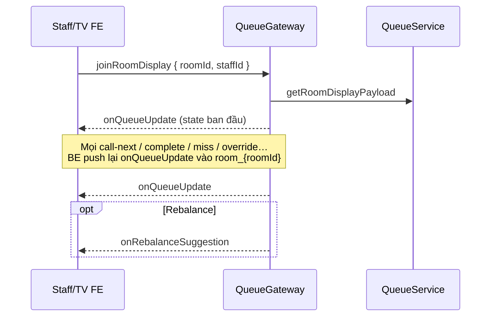
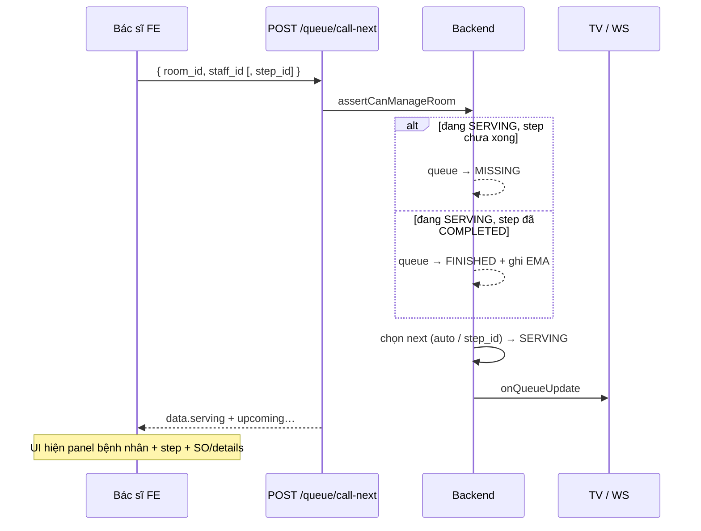
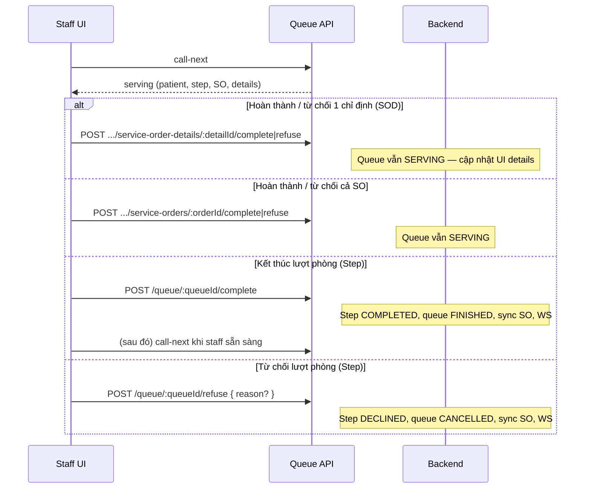
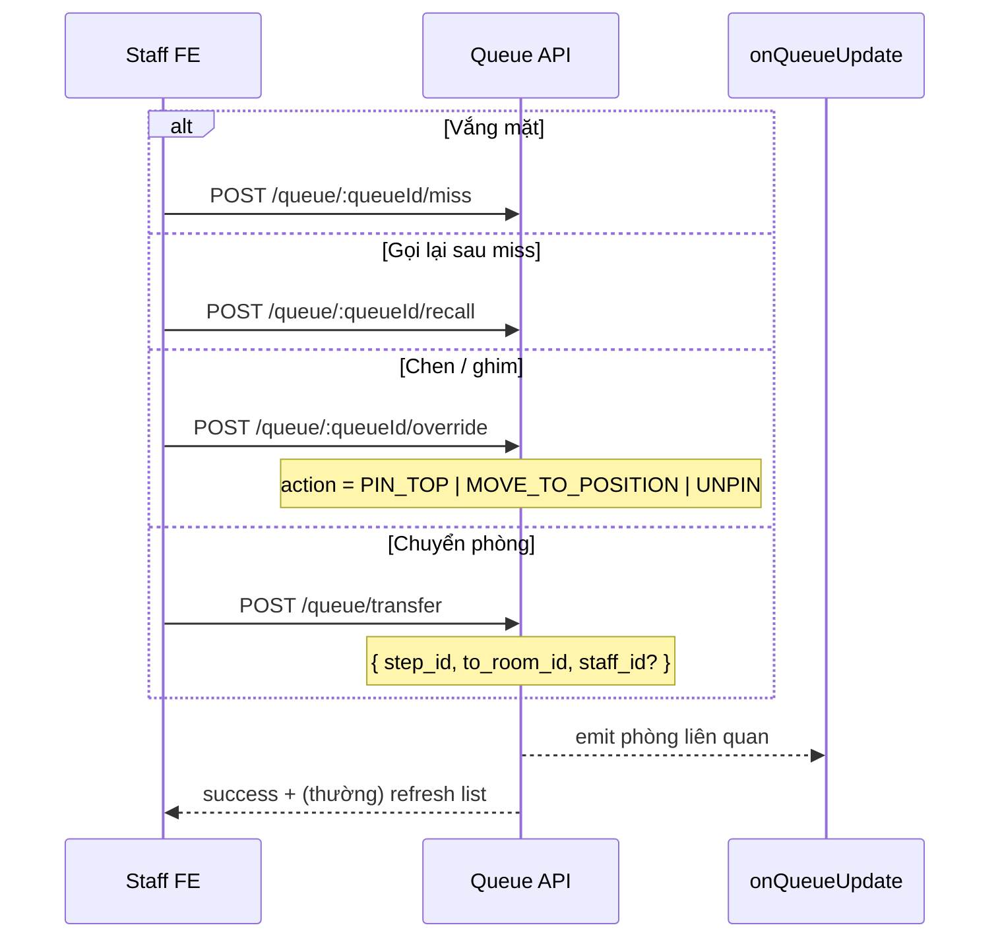
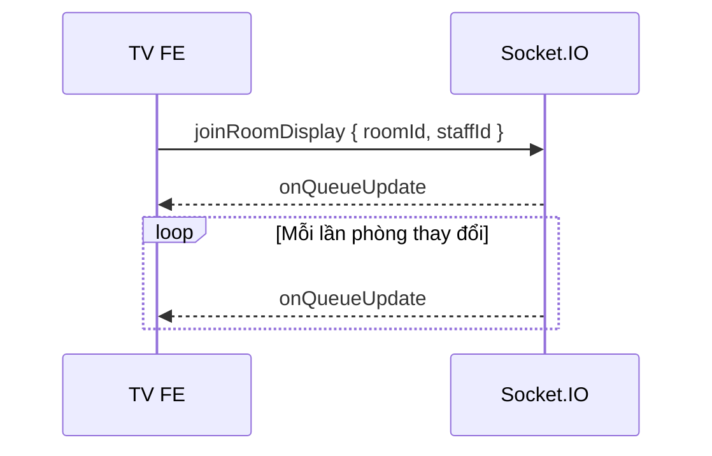
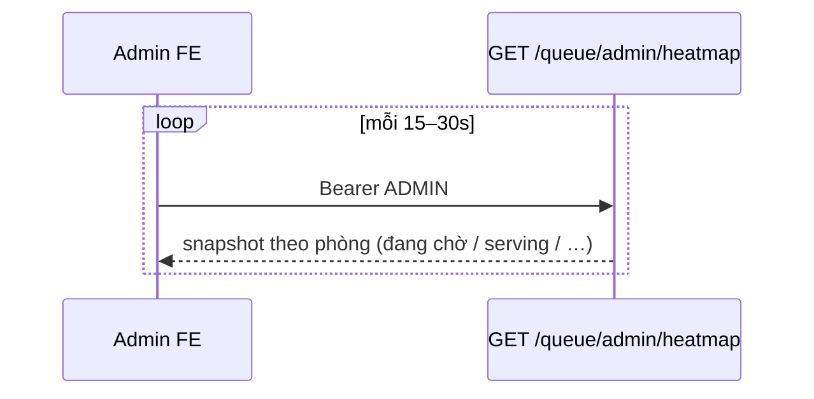
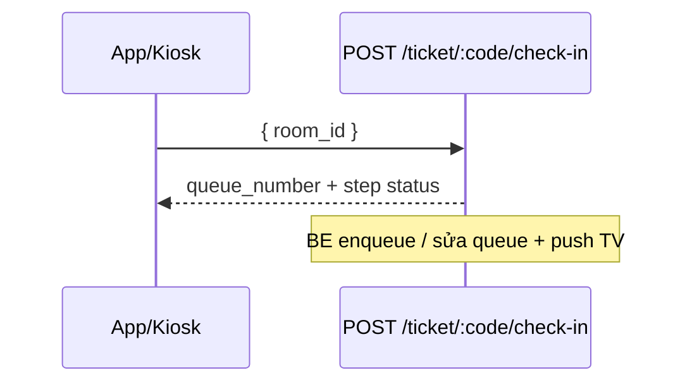

# Queue — Hướng dẫn triển khai Frontend

> Bản rút gọn từ [queue sumary.md](./queue%20sumary.md), tập trung API / payload / flow để FE implement.  
> Auth: Bearer token. Hầu hết API phòng cần staff có **shift hôm nay** tại phòng (hoặc `ADMIN`).

---

## 1. Màn hình cần làm

| Màn | Ai dùng | Nguồn dữ liệu chính |
| --- | --- | --- |
| **Staff phòng** | Bác sĩ / điều dưỡng | `GET /queue/room/:roomId` + WS `onQueueUpdate` |
| **TV phòng** | Public (không auth) | WS `joinRoomDisplay` → `onQueueUpdate` |
| **Gợi ý chuyển phòng** | Staff phòng liên quan | WS `onRebalanceSuggestion` + REST confirm/reject |
| **Admin heatmap** | ADMIN | Poll `GET /queue/admin/heatmap` 15–30s |
| **Admin rules / mapping** | ADMIN | CRUD `/queue/admin/...` |
| **Ticket bệnh nhân** | BN / kiosk | `GET /ticket/:code` (`queue_info`, ETA chỉ khi đang chờ) |

### Quy tắc hiển thị chung

1. **`queue_number` là string** — hiển thị nguyên; **không** sort theo số tăng dần. Thứ tự gọi = thứ tự `waiting[]` / `upcoming_patients[]` từ BE.
2. Sau **complete/refuse Step** → phòng trống; FE **tự gọi `call-next`** khi staff bấm (BE **không** auto call-next).
3. Complete/refuse **SOD hoặc SO** → queue **vẫn SERVING**; staff phải complete/refuse **Step** mới giải phóng phòng.

---

## 2. Realtime (WebSocket)



| Event | Hướng | Payload gợi ý |
| --- | --- | --- |
| `joinRoomDisplay` | FE → server | `{ roomId, staffId }` |
| `onQueueUpdate` | server → FE | TV payload (+ field `serving` đầy đủ cho staff) |
| `onRebalanceSuggestion` | server → FE (phòng nguồn & đích) | Suggestion PENDING |

**Staff:** ưu tiên WS; fallback poll `GET /queue/room/:roomId`.  
**TV:** chỉ cần `current_patient` (số + tên) + `upcoming_patients`.  
**Staff chi tiết:** dùng `serving` (patient / step / service_order).

---

## 3. Staff phòng — API & payload

### 3.1 Lấy hàng chờ

`GET /queue/room/:roomId`

```ts
// data (rút gọn)
{
  room_id: string;
  expected_service_minutes: number;
  serving: Serving | null;
  waiting: WaitingEntry[];
  missing: MissingEntry[];
}

type Serving = {
  queue_id: string;
  queue_number: string;
  serving_started_at: string | null;
  patient: {
    patient_id: string;
    full_name: string;
    dob: string | null;
    gender: string;
  } | null;
  step: {
    step_id: string;
    step_name: string;
    step_type: string;
    step_status: string;
    service_code: string | null;
  } | null;
  service_order: {
    service_order_id: string;
    name: string;
    status: string;
    details: {
      service_order_detail_id: string;
      name: string | null;
      service_id: string;
      service_code: string | null;
      service_name: string | null;
      quantity: number;
      status: string; // PENDING | PAID | IN_PROGRESS | COMPLETED | CANCELLED …
    }[];
  } | null;
};

type WaitingEntry = {
  position: number;
  queue_id: string;
  queue_number: string;
  patient_name: string;
  queue_type: string; // NEW | APPOINTMENT | RETURNING | TRANSFER …
  effective_score: number;
  reasons: string[];      // badge ưu tiên
  is_pinned: boolean;
  enqueued_at: string | null;
  waited_minutes: number;
  eta_minutes: number;
  eta_time: string | null;
};
```

### 3.2 Gọi bệnh nhân

`POST /queue/call-next`

```json
{ "room_id": "uuid", "staff_id": "uuid", "step_id": "uuid?" }
```

- Không `step_id` → gọi **đầu hàng** theo engine.  
- Có `step_id` → gọi đích danh (phải đang chờ đúng phòng).  
- Response: TV payload + **`serving`** đầy đủ.  
- Nếu còn lượt SERVING mà step chưa complete → BE auto **MISSING**; đã complete → **FINISHED**.



### 3.3 Complete / Refuse (3 cấp)



| Cấp | Method | Path | Sau gọi |
| --- | --- | --- | --- |
| SOD | POST | `/queue/:queueId/service-order-details/:detailId/complete` | Detail `COMPLETED`; SO có thể đóng; **queue SERVING** |
| SOD | POST | `/queue/:queueId/service-order-details/:detailId/refuse` | Detail `CANCELLED`; **queue SERVING** |
| SO | POST | `/queue/:queueId/service-orders/:orderId/complete` | Toàn SO `COMPLETED`; **queue SERVING** |
| SO | POST | `/queue/:queueId/service-orders/:orderId/refuse` | Toàn SO `CANCELLED`; **queue SERVING** |
| Step | POST | `/queue/:queueId/complete` | Step `COMPLETED`, queue `FINISHED` → phòng trống |
| Step | POST | `/queue/:queueId/refuse` body `{ "reason"? }` | Step `DECLINED`, queue `CANCELLED` → phòng trống |

**Gợi ý UI Serving:**

1. Header: số thứ tự + tên BN + DOB/gender.  
2. Block Step: tên / loại / status.  
3. List SOD: nút Complete / Refuse từng dòng (ẩn nếu status không còn active).  
4. Nút Complete / Refuse cả SO (nếu có `service_order`).  
5. Nút chính **Hoàn thành bước** / **Từ chối bước** (giải phóng phòng).  
6. Không gọi `call-next` tự động sau bước 5.

### 3.4 Miss / Recall / Override / Transfer



| Action | Endpoint | Body |
| --- | --- | --- |
| Miss | `POST /queue/:queueId/miss` | — |
| Recall | `POST /queue/:queueId/recall` | — |
| Override | `POST /queue/:queueId/override` | `{ action, position?, reason? }` |
| Transfer | `POST /queue/transfer` | `{ step_id, to_room_id, staff_id? }` |

`action`: `PIN_TOP` | `MOVE_TO_POSITION` | `UNPIN`  
`MOVE_TO_POSITION`: `position` = đứng sau ít nhất n người (hold).

Hiển thị `waiting`: badge `reasons`, icon pin nếu `is_pinned`, cột ETA (`eta_minutes` / `eta_time`).

---

## 4. Rebalance (chuyển phòng gợi ý)

Chỉ áp dụng CLS / thủ thuật tương đương (lab, imaging, procedure…). Staff **confirm** mới chuyển thật.

```mermaid
sequenceDiagram
  participant BE as Backend (cron / enqueue)
  participant WS as WebSocket
  participant Staff as Staff FE
  participant API as REST

  BE->>WS: onRebalanceSuggestion (phòng nguồn + đích)
  WS-->>Staff: hiện banner / modal gợi ý
  alt Đồng ý
    Staff->>API: POST /queue/rebalance/suggestions/:id/confirm
    Note over API: BN nhận số mới + phòng mới; giữ aging
  else Từ chối
    Staff->>API: POST /queue/rebalance/suggestions/:id/reject
  end
  API-->>WS: onQueueUpdate cả 2 phòng
```

| Method | Path | Ghi chú |
| --- | --- | --- |
| GET | `/queue/rebalance/suggestions?room_id=` | Staff: **bắt buộc** `room_id`. Admin: bỏ trống = all |
| POST | `/queue/rebalance/suggestions/:id/confirm` | Cần quyền phòng nguồn hoặc đích |
| POST | `/queue/rebalance/suggestions/:id/reject` | — |

---

## 5. TV Display



Dùng tối thiểu:

```ts
{
  room_info: { specialty_name, room_name, doctor_name };
  current_patient: { queue_number, patient_name } | null;
  upcoming_patients: { queue_number, patient_name, queue_type, eta_minutes, ... }[];
  timestamp: string;
}
```

Bỏ qua / không bắt buộc render `serving` trên TV.

---

## 6. Admin

| Method | Path | Mô tả |
| --- | --- | --- |
| CRUD | `/queue/admin/rules` | Rule ưu tiên / aging / rebalance (soft-delete) |
| CRUD | `/queue/admin/room-services` | Mapping phòng ↔ service (nhóm rebalance) |
| GET/PATCH | `/queue/admin/room-stats` | Default duration / xem EMA |
| GET | `/queue/admin/heatmap` | Snapshot mật độ chờ — **poll 15–30s** |



---

## 7. Bệnh nhân / Ticket

- `GET /ticket/:code` → có `queue_info` (số, phòng, ETA…).  
- **ETA chỉ tin cậy khi đang chờ** (PENDING/QUEUED). Khi SERVING / MISSING không dùng ETA “ảo” để countdown.

Check-in (nếu FE kiosk làm):



---

## 8. Checklist implement nhanh

### Staff phòng

- [ ] Load `GET /queue/room/:roomId` + join WS  
- [ ] List `waiting` theo thứ tự BE; badge `reasons`, pin, ETA  
- [ ] List `missing` + nút Recall  
- [ ] Nút Call-next (auto) + gọi đích danh (`step_id`)  
- [ ] Panel `serving`: BN + Step + SOD/SO actions  
- [ ] Complete/Refuse SOD → refresh serving (phòng chưa trống)  
- [ ] Complete/Refuse Step → clear serving; **chờ user** bấm call-next  
- [ ] Override / Miss / Transfer  
- [ ] Toast + UI cho `onRebalanceSuggestion`

### TV

- [ ] `joinRoomDisplay` + render số đang gọi + danh sách sắp tới  

### Admin

- [ ] Heatmap polling  
- [ ] CRUD rules / room-services / room-stats (nếu trong scope sprint)

---

## 9. Phân quyền (FE cần biết để ẩn nút)

| Hành động | Ai |
| --- | --- |
| Call-next, complete/refuse, override, miss, recall, room view | `ADMIN` hoặc staff **shift hôm nay** tại phòng |
| Rebalance list không `room_id` | Chỉ `ADMIN` |
| Confirm/reject rebalance | `ADMIN` hoặc staff phòng nguồn/đích |
| Admin rules / heatmap / room-services | `ADMIN` |
| TV payload / join display | Public |

Lỗi thường gặp: `403` không có shift; `400` gọi complete khi queue không `SERVING`; `400` hàng trống khi call-next.

---

## 10. Tham chiếu thêm

- Spec tổng BE: [queue sumary.md](./queue%20sumary.md)  
- Use case chen hàng: [priority.md](./priority.md) (trong `docs/`)  
- Overview kiến trúc: [00-overview.md](./00-overview.md)
