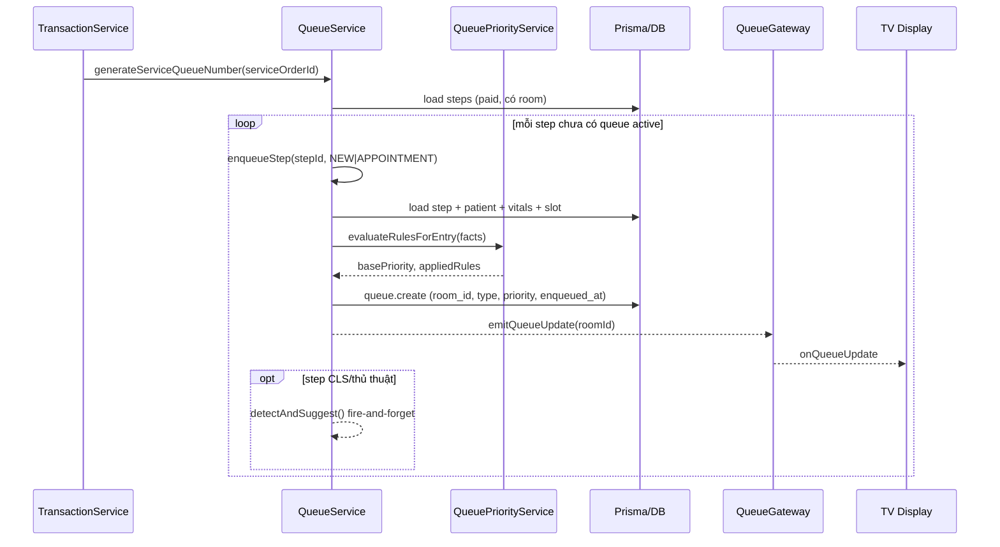
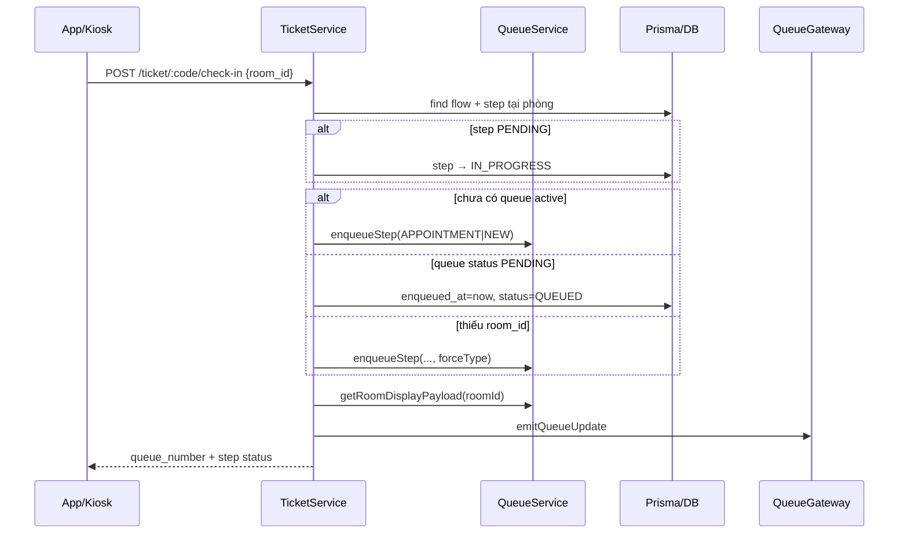
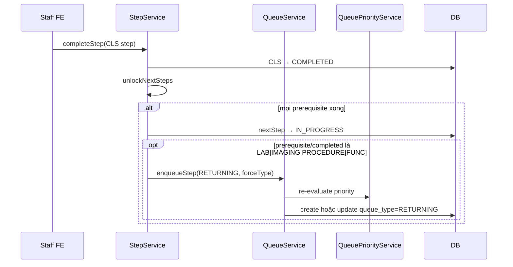
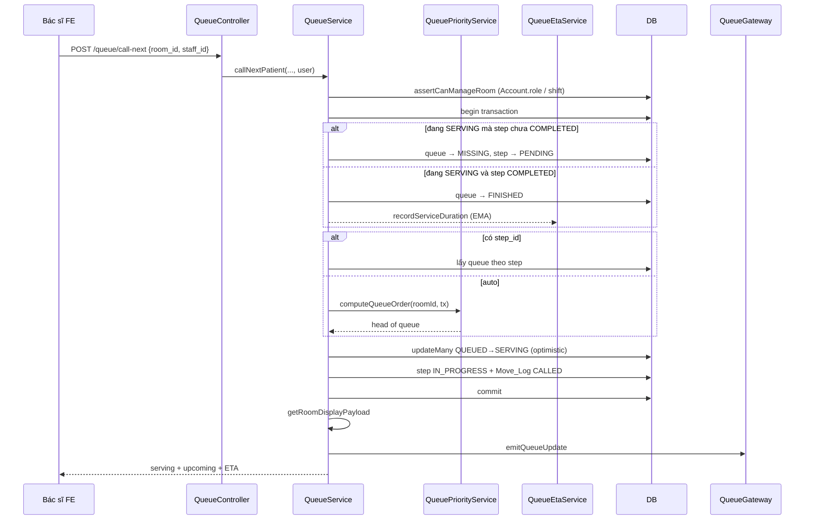
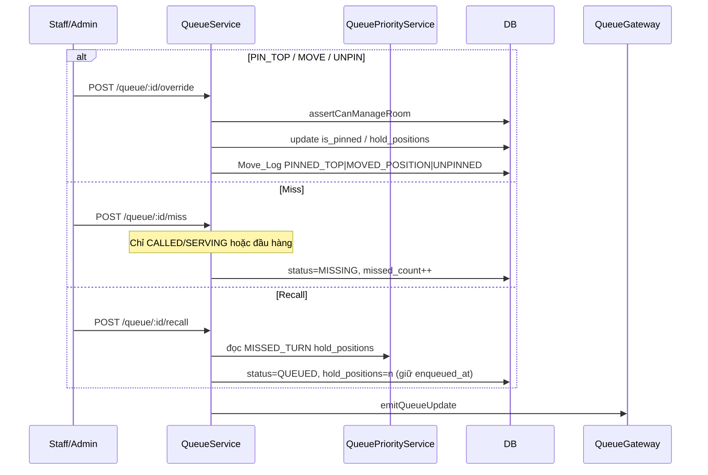
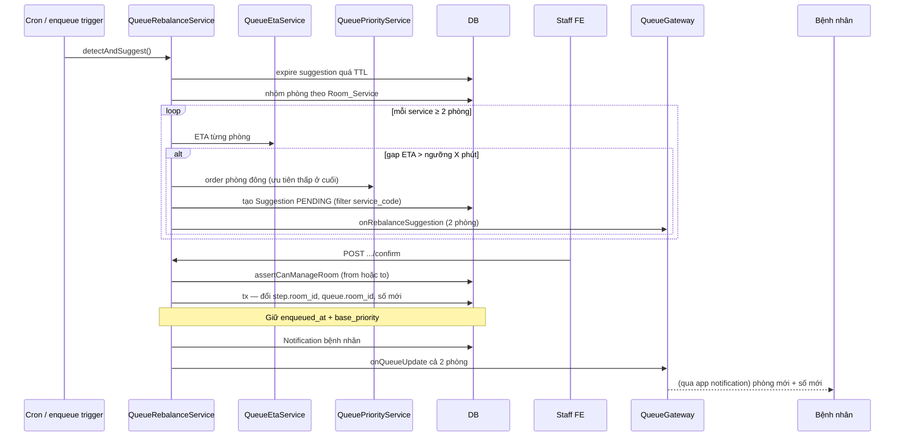
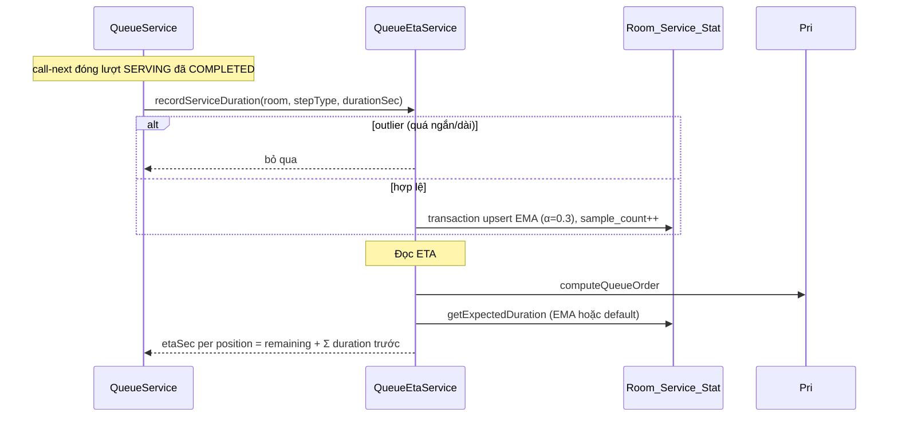
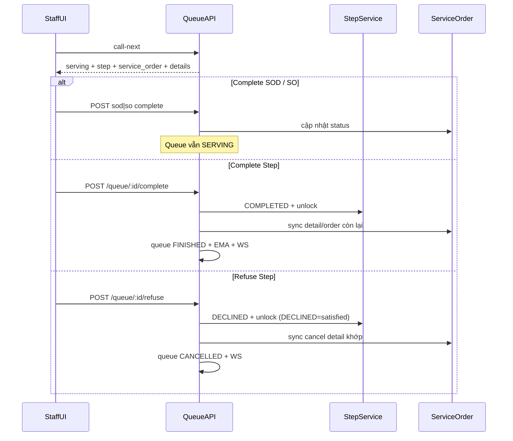

# Queue Management — Tổng Kết Triển Khai

> Tài liệu tổng hợp sau khi hoàn thành 7 phase + vá P0/P1/P2.  
> Spec chi tiết từng phase: [00-overview.md](./00-overview.md) và `phase-1` … `phase-7`.  
> Use case chen hàng: [priority.md](./priority.md).

---

## 1. Mục tiêu đã đạt

Hệ thống hàng chờ OPD từ FIFO (`step.created_at`) lên:

| # | Tính năng | Trạng thái |
| --- | --- | --- |
| 1 | Priority engine động (weight + aging + override cấu trúc) | Done |
| 2 | Chen hàng: RETURNING interleave, pin-top, miss/recall, transfer, quick-task | Done |
| 3 | ETA per patient / per room (EMA + fallback config) | Done |
| 4 | Admin CRUD rules / room-services / default duration | Done |
| 5 | Manual override có phân quyền (ADMIN hoặc staff có shift phòng) | Done |
| 6 | Heatmap mật độ chờ (REST, FE polling) | Done |
| 7 | Load balancing bán tự động giữa phòng CLS/thủ thuật tương đương | Done |

---

## 2. Kiến trúc (đã chốt & đã code)

| Quyết định | Lựa chọn triển khai |
| --- | --- |
| Ordering | Hybrid: `score = base_priority + aging` + pin-top / hold n / interleave |
| Aging | Rule `AGING` + `aging_rate` điểm/phút, có `max_aging` trần |
| ETA | EMA α≈0.3 theo `(room, step_type)`; `sample_count < 5` → `default_duration_sec` |
| Rule scope | Global + override theo `room_type` / `specialty_id` |
| Call-next | Auto đầu hàng; `step_id` optional gọi đích danh; updateMany optimistic lock |
| Rebalance | Chỉ `LAB_TEST` / `IMAGING` / `PROCEDURE` / `FUNCTIONAL_EXPLORATION`; staff confirm |
| Feature flag | `QUEUE_ENGINE_ENABLED` (mặc định bật) — tắt thì enqueue FIFO cơ bản |

### Module / service chính

| Thành phần | Vai trò |
| --- | --- |
| `QueueService` | `enqueueStep`, call-next, complete/refuse (Step/SOD/SO), override, miss/recall, transfer, staff room view, TV payload |
| `QueuePriorityService` | `evaluateRulesForEntry`, `computeQueueOrder` / `orderEntries` |
| `QueueEtaService` | EMA + ETA per room / patient |
| `QueueRebalanceService` | Detector nghẽn, suggestion, confirm/reject |
| `QueueAdminService` | CRUD rules, room-services, room-stats, heatmap |
| `QueueGateway` | WS `onQueueUpdate`, `onRebalanceSuggestion` (đăng ký trong `QueueModule`) |

### Model dữ liệu mới / mở rộng

- **Queue**: `room_id`, `queue_type`, `base_priority`, `applied_rules`, pin/hold, lifecycle timestamps (`enqueued_at`, `called_at`, `serving_started_at`, `finished_at`, `missed_at`…)
- **Queue_Priority_Rule**: rule admin cấu hình (seed 12 rule mặc định)
- **Room_Service_Stat**: EMA + default duration
- **Room_Service**: mapping phòng ↔ service (nhóm rebalance)
- **Queue_Rebalance_Suggestion**: gợi ý chuyển PENDING / CONFIRMED / REJECTED / EXPIRED
- **Move_Log**: audit (`CALLED`, `PINNED_TOP`, `MISSED`, `RECALLED`, `REBALANCED`, `TRANSFERRED`…)

### Điểm enqueue (một đường `enqueueStep`)

1. Sau thanh toán → `generateServiceQueueNumber`  
2. Booking lấy số khám → `enqueueStep(APPOINTMENT)`  
3. Ticket check-in → tạo / repair queue + reset `enqueued_at` lần đầu  
4. CLS xong unlock step khám → `RETURNING` (`forceType`)  
5. Transfer hội chẩn → cancel entry cũ + `TRANSFER` (một transaction)

---

## 3. API bề mặt

### Vận hành (`/queue`)

| Method | Path | Mô tả |
| --- | --- | --- |
| POST | `/queue/call-next` | Gọi tiếp theo (auto hoặc `step_id`); response có `serving` đầy đủ |
| POST | `/queue/transfer` | Chuyển phòng / hội chẩn |
| POST | `/queue/:queueId/override` | `PIN_TOP` / `MOVE_TO_POSITION` / `UNPIN` |
| POST | `/queue/:queueId/miss` | Đánh dấu vắng |
| POST | `/queue/:queueId/recall` | Gọi lại sau miss (hold n vị trí) |
| POST | `/queue/:queueId/complete` | Hoàn thành Step + đóng queue FINISHED; sync SO |
| POST | `/queue/:queueId/refuse` | Từ chối Step → DECLINED + queue CANCELLED; sync SO |
| POST | `/queue/:queueId/service-order-details/:detailId/complete` | SOD → COMPLETED (queue vẫn SERVING) |
| POST | `/queue/:queueId/service-order-details/:detailId/refuse` | SOD → CANCELLED (queue vẫn SERVING) |
| POST | `/queue/:queueId/service-orders/:orderId/complete` | Toàn bộ SO COMPLETED (queue vẫn SERVING) |
| POST | `/queue/:queueId/service-orders/:orderId/refuse` | Toàn bộ SO CANCELLED (queue vẫn SERVING) |
| GET | `/queue/room/:roomId` | Staff view: serving (patient/step/SO+details) + waiting + ETA |
| GET | `/queue/rebalance/suggestions` | Danh sách gợi ý (staff: có `room_id`; admin: all) |
| POST | `/queue/rebalance/suggestions/:id/confirm` | Xác nhận chuyển |
| POST | `/queue/rebalance/suggestions/:id/reject` | Từ chối |

### Admin (`/queue/admin`)

| Method | Path | Mô tả |
| --- | --- | --- |
| CRUD | `/queue/admin/rules` | Priority / aging / rebalance rules (soft-delete) |
| CRUD | `/queue/admin/room-services` | Mapping phòng ↔ service |
| GET/PATCH | `/queue/admin/room-stats` | Default duration / xem EMA |
| GET | `/queue/admin/heatmap` | Snapshot mật độ chờ theo phòng |

### Bệnh nhân / TV

- `GET /ticket/:code` — thêm `queue_info` (ETA chỉ khi đang chờ)
- TV: `joinRoomDisplay` → `onQueueUpdate` (payload có thứ tự engine + ETA)

---

## 4. Tóm tắt 7 phase

| Phase | Nội dung đã làm |
| --- | --- |
| **1 Schema** | Enums `QueueType` / `QueueRuleType` / rebalance status; mở rộng Queue & Move_Log; model Rule, Stat, Room_Service, Suggestion; seed 12 rule |
| **2 Engine** | `matchConditions`, `orderEntries` (score, pin, interleave, hold); unit test |
| **3 Enqueue** | `enqueueStep` tập trung; wire payment / check-in / RETURNING / transfer; display dùng engine |
| **4 Lifecycle** | Call-next auto, override/miss/recall, assertCanManageRoom, Move_Log, cron cuối ngày / rebalance |
| **5 ETA** | `recordServiceDuration`, `computeEtaForRoom`; gắn staff view, TV, ticket |
| **6 Rebalance** | Least-ETA lúc tạo service order; detector cron + sau enqueue; confirm giữ aging |
| **7 Admin** | CRUD rules & mapping; heatmap snapshot |

### Vá sau review (P0 → P2)

- P0: DI `QueueGateway` trong `QueueModule`; wire RETURNING/check-in/booking qua `enqueueStep`  
- P1: Auth đọc role từ `Account`; khóa suggestion list; filter `service_code`; miss guard; call-next/transfer atomic; timezone VN  
- P2: `interleave_ratio` từ rule; trigger rebalance sau enqueue; EMA trong tx; heatmap chỉ phòng có activity; ticket không fake ETA khi SERVING/MISSING  

---

## 5. Sequence diagrams

### 5.1 Enqueue sau thanh toán / tạo số



### 5.2 Check-in tại phòng



### 5.3 RETURNING sau CLS



### 5.4 Call-next (auto)



### 5.5 Override / Miss / Recall



### 5.6 Load balancing (rebalance)



### 5.7 ETA khi kết thúc lượt



### 5.8 Serving complete / refuse (sau call-next)

Staff sau `call-next` xem `serving` (patient + step + service_order + details) rồi thao tác **3 cấp**. **Không** tự call-next sau complete/refuse.

| Cấp | Endpoint | Step / Queue | SO / SOD |
| --- | --- | --- | --- |
| SOD | `.../service-order-details/:id/complete\|refuse` | Queue **vẫn SERVING** | Detail COMPLETED / CANCELLED; SO đóng nếu hết detail active |
| SO | `.../service-orders/:id/complete\|refuse` | Queue **vẫn SERVING** | Mọi detail active + SO → COMPLETED / CANCELLED |
| Step | `POST /queue/:queueId/complete\|refuse` | Step COMPLETED / DECLINED; queue FINISHED / CANCELLED + EMA + WS | Sync detail khớp `service_code` (hoặc toàn bộ active) |

Quy ước:

- Refuse **Step** = `StepStatusEnum.DECLINED`; prerequisite coi `COMPLETED` **hoặc** `DECLINED` là đã thỏa → unlock bước sau.
- RETURNING chỉ khi unlock bởi CLS **COMPLETED** (decline không enqueue RETURNING).
- Refuse SOD/SO map `CANCELLED` (không có enum DECLINED trên SOD/SO).
- `PATCH /step/:id/complete` (legacy) cũng đóng queue SERVING nếu còn + sync SO.



---

## 6. Phân quyền nhanh

| Hành động | Ai được |
| --- | --- |
| Call-next / complete / refuse / override / miss / recall / room view | ADMIN (role DB) hoặc staff có **shift hôm nay** tại phòng / gán trên step |
| Rebalance list không `room_id` | Chỉ ADMIN |
| Rebalance confirm/reject | ADMIN hoặc staff phòng nguồn/đích |
| Admin rules / heatmap / room-services | ADMIN (`IsRoleGuard`) |
| TV display payload | Public (WS join room) |

---

## 7. File code tham chiếu

```
src/routes/queue/
  queue.service.ts
  queue-priority.service.ts
  queue-eta.service.ts
  queue-rebalance.service.ts
  queue-admin.service.ts
  queue.constants.ts          # REBALANCEABLE_STEP_TYPES
  queue.module.ts
  queue.controller.ts
  queue-admin.controller.ts
prisma/queue-rules.seed.ts
src/shared/gateways/queue.gateway.ts
```

Hook ngoài module queue: `ticket.service` (check-in), `step.service` (RETURNING), `booking.service` (lấy số), `service_order.service` (least-ETA), `transaction.service` (sau thanh toán), `cron.service` (rebalance + đóng ngày).

---

## 8. Ghi chú vận hành FE

1. Staff polling `GET /queue/room/:roomId` hoặc lắng nghe `onQueueUpdate` — dùng `serving` (patient/step/SO).  
2. Sau call-next: complete/refuse SOD hoặc SO trước nếu cần; **complete/refuse Step** để giải phóng phòng (không auto call-next).  
3. Admin polling `GET /queue/admin/heatmap` mỗi 15–30s.  
4. Rebalance: lắng nghe `onRebalanceSuggestion`, gọi confirm/reject.  
5. `queue_number` hiển thị giữ string; thứ tự gọi theo engine, không theo số tăng dần thuần.  
6. Khi tắt engine: set `QUEUE_ENGINE_ENABLED=false`.
